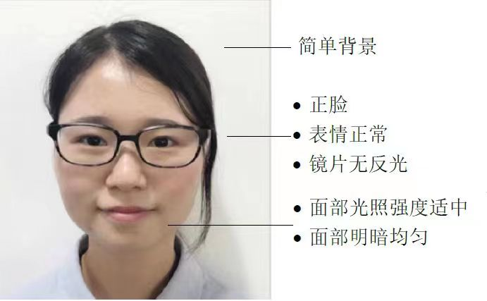

# 1.3师生人脸ID照片

## 人像收集要求：&#x20;

1.上传图片格式必须为jpg格式；&#x20;

2.图片命名为学生姓名，一个班级一个文件夹；&#x20;

3.上传图片像素大小上限为960_960，下限为500_500；&#x20;

4.上传图片文件内存大小必须小于100KB；&#x20;

5.上传图片必须具有真实性，不要美图、P图等；

6.照片背景选择白色为最佳，保证人脸光照足够、受光均匀，人脸面部图像清晰。 7.若学生重名，则后面备注1/2

<figure><figcaption></figcaption></figure>

<figure><figcaption></figcaption></figure>
